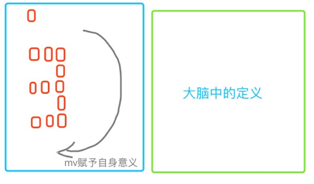

  

1. 1920年代，心理学家Karl Lashley发现记忆缺陷程度与脑损伤部位无关，而与损伤的大小有关，提出记忆是弥散在大脑里的。

2. 1957年，Scoville与Milner根据H.M病例提出：长时记忆在：海马和杏仁核。成为科学界的普遍共识。

3. 刘旭与Steve Ramirez因操纵记忆的研究。提出"海马与杏仁核，记忆之源"。

4. 2018年4月6日MIT论文，揭示记忆在海马体和新皮层同时形成的，而在到达成熟状态之前，短期记忆最初只形成并存储在海马体中，然后前额叶皮层变强，海马体变弱。经过多重模型跟踪，记忆细节痕迹在海马体，而记忆轮廓则在新皮层。
> 1. 三个区域的记忆细胞（engram 细胞）：海马体、前额叶皮层和杏仁核（情绪联系）。
> 2. 一些记忆痕迹可能会无限期地停留在海马体中，存储一些仅偶尔会被检索到的细节。

5. 最新发表在Nature上的一项成果指出研究发现，一旦成人后，海马体的神经元似乎就停止产生了。

  

## 视频地址:
<https://www.bilibili.com/video/av23032150?t=1246>
