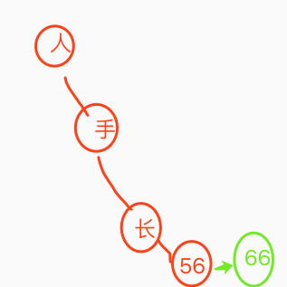

# GNOP

***

<!-- TOC depthFrom:1 depthTo:6 withLinks:1 updateOnSave:1 orderedList:0 -->

- [GNOP](#gnop)
	- [n11p1 最简](#n11p1-最简)
	- [n11p2 logic的结构化](#n11p2-logic的结构化)
	- [n11p3 性能优化](#n11p3-性能优化)
	- [n11p4 logic归纳结构的形成过程（从意识流到logic归纳）](#n11p4-logic归纳结构的形成过程从意识流到logic归纳)
	- [n11p5 change的形成](#n11p5-change的形成)
	- [n11p6 Real-identNode的形成](#n11p6-real-identnode的形成)
	- [n11p7 RIN的形成2](#n11p7-rin的形成2)
	- [Other](#other)

<!-- /TOC -->

## n11p1 最简
`CreateTime 2018.02.03`

| 前言 >> |
| --- |
| 本节,为找到未能最简化的设计,并进行改良; |

***

| 删AILine >> |
| --- |
| 去掉AILine,由AIPort来替代;`参考当天代码;` |

***

| 删AIChangeNode,AILogicNode >> |  |
| --- | --- |
| 命题: | 关于删除AIChangeNode,AILogicNode的思考 |
| 分析: | 时间产生了动,动产生了变化,产生了逻辑 |
| 核心起因: | 去掉AIChangeNode,变化由静态数据表示,不会是正确的方式; |
| 命题起因: | 1. change和logic并非最简设计; 2. 关于时间时序的知识表示未能完美解决 |
| 问题点: | 1. 不能因时序产生大量数据; 2. 不能因时序破坏原有网络结构 |
| 入口: | 从cmv的变化入手,changeNode确有必要,即真实的结构为:`定义->属性->值->变化` |
| 知识表示: | changeNode有时应体现在absNode上,作为changeNode存在,因为具象信息有明确值 |
| 注: | 先后,from表示先,to表示后; |
| 结果: | changeNode和logicNode删除失败,但需要改进 |

| logic的知识表示问题 >> |  |
| --- | --- |
| 命题: | logic需要横跨node;所以logic要么单独设计表示方式,但又不能脱离原有"归纳网络" |

|  |
| --- |

***

| 删除thinkDeep和shallow,合为1 >> |
| --- |
| mv激发的能量值已经说明了一切,没有mv无法形成思维循环,只有很弱的`能量值`,所以不需要deep和shallow |

     

## n11p2 logic的结构化
`CreateTime 2018.02.04`

| logic >> |  |
| --- | --- |
| 介绍 | change因logic才有了意义,而logic依附于`归纳网络`中,所以有了各种复杂的问题解决能力 |
| 生成原则 | 与其它node类似,只有think想到的才会产生关联,而shallowThink弱,deepThink强关联 |

     

## n11p3 性能优化
`CreateTime 2018.02.04`

| 性能优化 >> |
| --- |
| 1. 按dataType分维存储(以`dataType`和`dataSource`和`值`为索引,快速定位到指定维) |

     

## n11p4 logic归纳结构的形成过程（从意识流到logic归纳）
`CreateTime 2018.02.26`

| 前言 >> |
| --- |
| 以change到logic的结构形成，并非由无数change触发,而是由mv与思维构建。故本节深入思考:由意识流到`类比思维处理`成`logic结构化`的过程。将`change触发`改为由`mv触发`并解决其中几个难点;(参考下文) |

***

| 意识流 >> |
| --- |
| 在thinkingControl中有longCaches来存储所有思维处理过的`信号序列`; |

***

| logic结构化 >> |
| --- |
| logic结构化由`类比思维`形成,并由`changePorts`和`logicPorts`知识表示; |

***

| 示图 >> |
| --- |
|  |
| 1. change在哪一层级(杯子的高度变化,还是仅高度的变化,或是仅值的变化) |
| 2. logic的存储与读出,精确无歧义(知识表示不能脱离`归纳结构`网络) |
| 3. 依赖`思维类比`而构建 |

     

## n11p5 change的形成
`CreateTime 2018.02.27`

| 形成条件 >> | change必须依附在某node对象实例上; |
| --- | --- |
| 知识例1 | A的手长56->变为66 |
| 示图 |  |
| 知识例2（思考） | 1. A的手会变长; 2. B的也会; 3. 所有人都会; 4. 除了C |

***

| 形成步骤 >> |  |
| --- | --- |
| 1 | imv |
| 2 | `假设每个字符串输入都是一个真实世界对象` algsStr时 |
| 3 | 到网络中作唯一性判定,找到`对应Node`(依附对象) |
| 4 | 观察输入的algDic的value变化 |

     

## n11p6 Real-identNode的形成
`CreateTime 2018.02.27`

| 概念 >> |
| --- |
| 在input.algs中;将algDic输入,但algsDic只是针对algs的Model,而并不是真实世界的对象,所以真实世界的对象`Real-identNode`,由thinking根据law形成; |
| RIN基于algsDic的kv;但由thinking类比的law所构建;故:RIN是原始数据的发酵与升华; |

***

| 对象边界的判定难易度 >> | 算法值的复杂度决定判定难易度 |
| --- | --- |
| 1 | 在字符串、imv等输入上，很容易判定其“对象边界”。 |
| 2 | 在图片、音频等上，不容易判定其“对象边界”。 |

***

| 对象边界的判定方式 >> | 本质上是对"值"的类比规律判定 |
| --- | --- |
| 1 | 对字符串，使用字符串切割为char算法即可 |
| 2 | 对imv，使用type判定即可 |
| 3 | 对图片，借助边缘检测，材质等算法进行辅助 |
| 4 | 对音频，使用对应算法，类比判定即可 |

     

## n11p7 RIN的形成2
`CreateTime 2018.02.28`

| 模糊性 >> |
| --- |
| RIN的边界是模糊的,因为思维从来只为其类比结果运作与事务,所以边界不会特别清晰; |

***

| 作用 >> |
| --- |
| RIN是algsDic产生Thinking定义的方式 |
| RIN对智能、性能优化等有重大意义。 |
| RIN直接面向思维的数据 |
| algsDic到RIN是第一次零散到整体; |

***

| algsDic是RIN养料 >> |
| --- |
|  |

     

## Other

| toDoList >> | task | status |
| --- | --- | --- |
| 1 | 对各种dataSource的记录;(将mvCharge和mvHunger信号处理后类型分开) | T |
| 2 | 对各种change,用潜意识流logic串起来; |  |
| 3 | 对导致cmv变化的change,进行类比缩小范围; |  |
| 4 | 对缩小范围的change用显意识流logic串起来; |  |
| 5 | 对全局检索进行优化:`分dataType,分dataSource,然后将归纳网络挂到下面` | T |
| 6 | 加上能量值 |  |
| 7 | 并且将`port强度`写完善 |  |
| 8 | 然后将`ports默认排序` |  |
| 9 | 测试一次thinking循环的性能 |  |
| 10 | 合并deep和shallow | T |
| 11 | 第二信号传入 | T |
| 12 | 第二信号的input | T |
| 13 | 第二信号的change |  |
| 14 | 形成一个RIN定义 |  |

     
