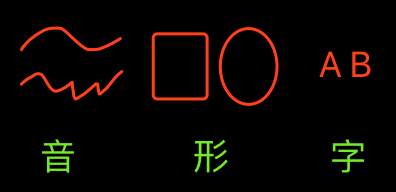
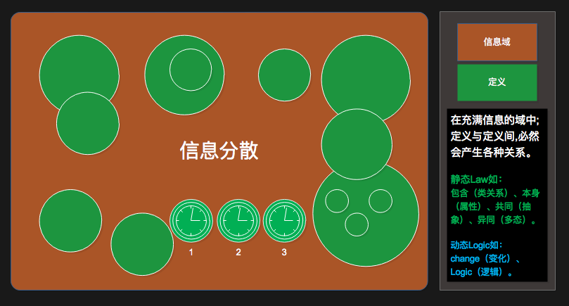
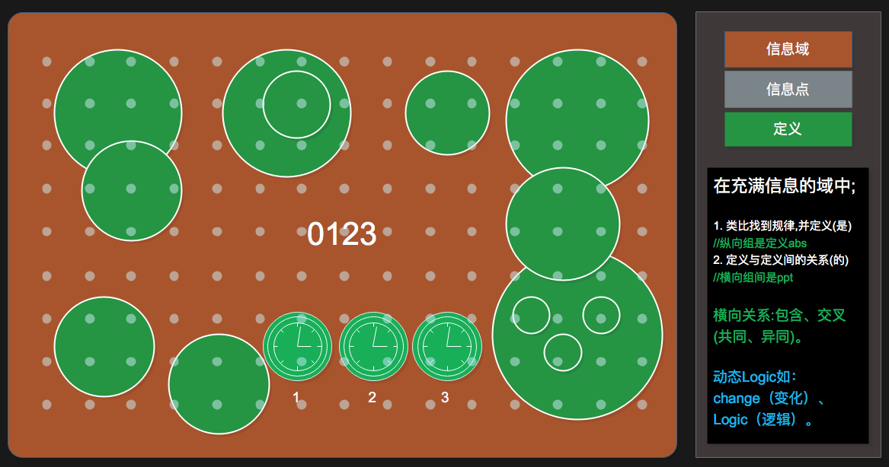
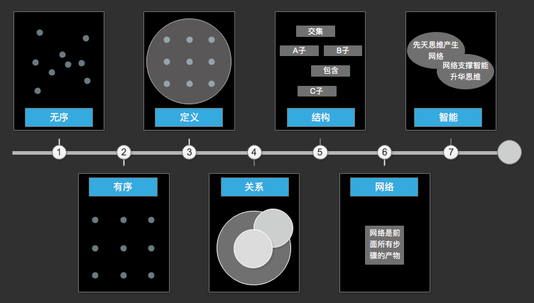
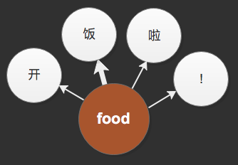
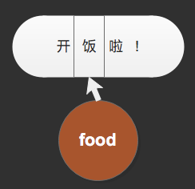
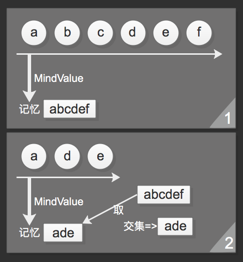
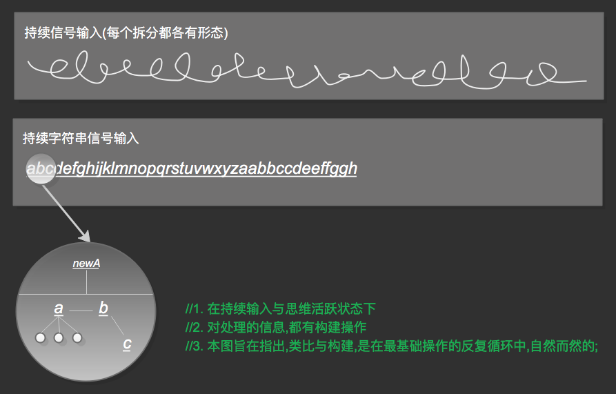
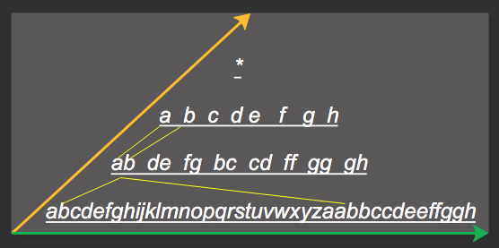
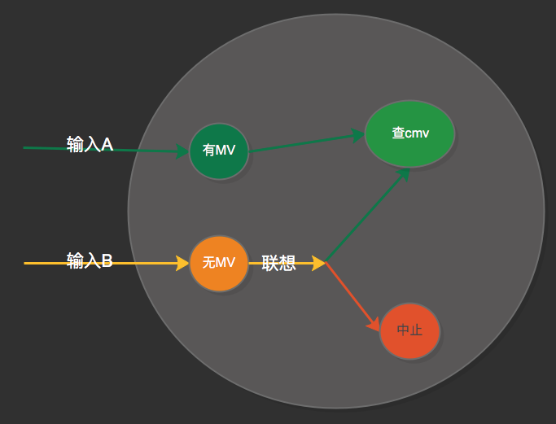

# GNOP

> GNOP(面向生成式网络编程),是smg的核心编程思想,也是smg的技术框架,
>
> `注:系统架构只是smg的系统结构,但技术框架才是将软件技术与系统架构融合思考的产物。(技术框架的一切为了实现)`

***

<!-- TOC depthFrom:1 depthTo:6 withLinks:1 updateOnSave:1 orderedList:0 -->

- [GNOP](#gnop)
	- [n11p1 最简](#n11p1-最简)
	- [n11p2 logic的结构化](#n11p2-logic的结构化)
	- [n11p3 性能优化](#n11p3-性能优化)
	- [n11p4 logic归纳结构的形成过程（从意识流到logic归纳）](#n11p4-logic归纳结构的形成过程从意识流到logic归纳)
	- [n11p5 change的形成](#n11p5-change的形成)
	- [n11p6 Real-identNode的形成](#n11p6-real-identnode的形成)
	- [n11p7 RIN的形成2](#n11p7-rin的形成2)
	- [n11p8 RIN的网络化](#n11p8-rin的网络化)
	- [n11p9 用信息域和集合定义的方式表示结构](#n11p9-用信息域和集合定义的方式表示结构)
	- [n11p10 RIN的网络化2](#n11p10-rin的网络化2)
	- [n11p11 知识表示-宏微版](#n11p11-知识表示-宏微版)
	- [n11p12 GNOP-宏微版](#n11p12-gnop-宏微版)
	- [n11p13 思考smg的架构bug](#n11p13-思考smg的架构bug)
	- [n11p14 从定义过程看四种结构](#n11p14-从定义过程看四种结构)
	- [n11p15 定义_代码](#n11p15-定义代码)
	- [n11p16 定义_粒度](#n11p16-定义粒度)
	- [n11p17 类比](#n11p17-类比)
	- [n11p18 构建](#n11p18-构建)
	- [n11p19 思维代码处理部分](#n11p19-思维代码处理部分)
	- [Other](#other)

<!-- /TOC -->

## n11p1 最简
`CreateTime 2018.02.03`

| 前言 >> |
| --- |
| 本节,为找到未能最简化的设计,并进行改良; |

***

| 删AILine >> |
| --- |
| 去掉AILine,由AIPort来替代;`参考当天代码;` |

***

| 删AIChangeNode,AILogicNode >> |  |
| --- | --- |
| 命题: | 关于删除AIChangeNode,AILogicNode的思考 |
| 分析: | 时间产生了动,动产生了变化,产生了逻辑 |
| 核心起因: | 去掉AIChangeNode,变化由静态数据表示,不会是正确的方式; |
| 命题起因: | 1. change和logic并非最简设计; 2. 关于时间时序的知识表示未能完美解决 |
| 问题点: | 1. 不能因时序产生大量数据; 2. 不能因时序破坏原有网络结构 |
| 入口: | 从cmv的变化入手,changeNode确有必要,即真实的结构为:`定义->属性->值->变化` |
| 知识表示: | changeNode有时应体现在absNode上,作为changeNode存在,因为具象信息有明确值 |
| 注: | 先后,from表示先,to表示后; |
| 结果: | changeNode和logicNode删除失败,但需要改进 |

| logic的知识表示问题 >> |  |
| --- | --- |
| 命题: | logic需要横跨node;所以logic要么单独设计表示方式,但又不能脱离原有"归纳网络" |

|  |
| --- |

***

| 删除thinkDeep和shallow,合为1 >> |
| --- |
| mv激发的能量值已经说明了一切,没有mv无法形成思维循环,只有很弱的`能量值`,所以不需要deep和shallow |

     

## n11p2 logic的结构化
`CreateTime 2018.02.04`

| logic >> |  |
| --- | --- |
| 介绍 | change因logic才有了意义,而logic依附于`归纳网络`中,所以有了各种复杂的问题解决能力 |
| 生成原则 | 与其它node类似,只有think想到的才会产生关联,而shallowThink弱,deepThink强关联 |

     

## n11p3 性能优化
`CreateTime 2018.02.04`

| 性能优化 >> |
| --- |
| 1. 按dataType分维存储(以`dataType`和`dataSource`和`值`为索引,快速定位到指定维) |

     

## n11p4 logic归纳结构的形成过程（从意识流到logic归纳）
`CreateTime 2018.02.26`

| 前言 >> |
| --- |
| 以change到logic的结构形成，并非由无数change触发,而是由mv与思维构建。故本节深入思考:由意识流到`类比思维处理`成`logic结构化`的过程。将`change触发`改为由`mv触发`并解决其中几个难点;(参考下文) |

***

| 意识流 >> |
| --- |
| 在thinkingControl中有longCaches来存储所有思维处理过的`信号序列`; |

***

| logic结构化 >> |
| --- |
| logic结构化由`类比思维`形成,并由`changePorts`和`logicPorts`知识表示; |

***

| 示图 >> |
| --- |
|  |
| 1. change在哪一层级(杯子的高度变化,还是仅高度的变化,或是仅值的变化) |
| 2. logic的存储与读出,精确无歧义(知识表示不能脱离`归纳结构`网络) |
| 3. 依赖`思维类比`而构建 |

     

## n11p5 change的形成
`CreateTime 2018.02.27`

| 形成条件 >> | change必须依附在某node对象实例上; |
| --- | --- |
| 知识例1 | A的手长56->变为66 |
| 示图 |  |
| 知识例2（思考） | 1. A的手会变长; 2. B的也会; 3. 所有人都会; 4. 除了C |

***

| 形成步骤 >> |  |
| --- | --- |
| 1 | imv |
| 2 | `假设每个字符串输入都是一个真实世界对象` algsStr时 |
| 3 | 到网络中作唯一性判定,找到`对应Node`(依附对象) |
| 4 | 观察输入的algDic的value变化 |

     

## n11p6 Real-identNode的形成
`CreateTime 2018.02.27`

| 概念 >> |
| --- |
| 在input.algs中;将algDic输入,但algsDic只是针对algs的Model,而并不是真实世界的对象,所以真实世界的对象`Real-identNode`,由thinking根据law形成; |
| RIN基于algsDic的kv;但由thinking类比的law所构建;故:RIN是原始数据的发酵与升华; |

***

| 对象边界的判定难易度 >> | 算法值的复杂度决定判定难易度 |
| --- | --- |
| 1 | 在字符串、imv等输入上，很容易判定其“对象边界”。 |
| 2 | 在图片、音频等上，不容易判定其“对象边界”。 |

***

| 对象边界的判定方式 >> | 本质上是对"值"的类比规律判定 |
| --- | --- |
| 1 | 对字符串，使用字符串切割为char算法即可 |
| 2 | 对imv，使用type判定即可 |
| 3 | 对图片，借助边缘检测，材质等算法进行辅助 |
| 4 | 对音频，使用对应算法，类比判定即可 |

     

## n11p7 RIN的形成2
`CreateTime 2018.02.28`

| 模糊性 >> |
| --- |
| RIN的边界是模糊的,因为思维从来只为其类比结果运作与事务,所以边界不会特别清晰; |

***

| 作用 >> |
| --- |
| RIN是algsDic产生Thinking定义的方式 |
| RIN对智能、性能优化等有重大意义。 |
| RIN直接面向思维的数据 |
| algsDic到RIN是第一次零散到整体; |

***

| algsDic是RIN养料 >> |
| --- |
|  |
| 注: 本图明确划分了:哪些应该由algs完成,而哪些应该由thinking类比; |
| 例: 你不能通过怒吼吓跑蚊子,但可以通过扰乱空气达到目的; |

     

## n11p8 RIN的网络化
`CreateTime 2018.03.01`

| 概念 >> |
| --- |
| 从RIN定义到其结构化为归纳网络,Thinking以此决定了Node间的关联; |
| 故本节重点研究前额叶数据的`从定义到结构化`; |

***

| 先后天属性 >> |
| --- |
| algsDic中的某个key为先天属性; |
| 先天属性有值,经比较后,产生的定义为后天属性; |
| ​先天属性：颜色（algsValue） |
| 后天属性：胳膊（包含关系） |
|  |

***

| 思考 >> |  |
| --- | --- |
| Q: | 类比的过程 |
| A: | `类比结果` -> `Law` -> `大小(后天属性)` -> `三生万物(要保证万物的结构化)` |
| Q: | 当没有了algsDic的故有结构,属性如何形成? |
| A: | 类比相同为抽象,类比异同为属性; |
| Q: | (代码只能写到三,但要保证万的结构化)如何保证? |
| A: | 考虑改进现在AINode结构(4大ports结构),即:再简化;`参考n11p9` |

***

| 示图 >> |
| --- |
|  |
| 一条知识示图,辅助思考从 1. 类比 2. 到Law 3. 再到后天属性 4. 后天定义 5. 再到结构化; |

     

## n11p9 用信息域和集合定义的方式表示结构
`CreateTime 2018.03.02`

| 简介 >> |
| --- |
| 以absPorts和pptPorts等的方式,无法实现"自然而然的结构化";并且以abs和ppt为起点,是思维定式使然,并未从简至繁的思考; |
| 故:本节试图通过信息域的方式,以类比到规律的"集合定义",来思考归纳网络的生成; |

***

| 示图 >> |
| --- |
|  |
| PIN的data是一个array; |

***

| 生成第一个RIN-代码例 >> |
| --- |

|  |  |
| --- | --- |
| 1 | 输入"imv"与"字符串"时,将思考到的存起来(algsDic作为事务参数就算事务结果为nil也会存) |
| 2 | 再次输入"imv"时,便有了联想与类比; |
| 3 | 初次类比的目的仅是找出信息集合,并进行定义 |
| 4 | 完成 |
| 注 | 整个过程与时间赛跑,因为GC会用进废退 |

***

| 完全以类比的结果为依据创建结构化网络; >> |
| --- |
| 1. 单纯找到规律并定义,与当下的统计学方式无区别 |
| 2. 而后续的用进废退,与当下的alphaGoZero的强化学习也无明显区别 |
| 3. 而不同在于;下表 >> |

| 动态构建结构网络 的独特 >> |
| --- |
| 1. 通过最简单的类比,表示真实世界的游戏规则 |
| 2. 用归纳结构网络作表示所有知识;(灵活模糊等特性) |
| 3. 用自由的思维作构建者 |
| 4. 用mv作思维的最简规则 |
| 5. 用law打通由细分到抽象的纵向通路;(本节思考部分) |
| 6. RIN部分的归纳网络完全由思维说了算,无代码干预(本节思考部分,找到这个边界`代码与非代码各处理哪些`) |

***

| 避免构建重复内容 >> |
| --- |
| 1. 包含关系:当从定义中,再找到定义时,如何构建关联? |
| 2.  |

     

## n11p10 RIN的网络化2
`CreateTime 2018.03.05`

| 思考`RIN到网`的方式 >> |  | 原因 |
| --- | --- | --- |
| 1. 从GNOP和OOP出发 | 错 | 以结果推结果 |
| 2. 从代码实现出发 | 对(50%-100%) | 从细 |
| 3. 从自省,心理学出发 | 对(0%-50%) | 从简 |

| 状态表示 >> |
| --- |
|  |

     

## n11p11 知识表示-宏微版
`CreateTime 2018.03.08`

| 概念 >> |
| --- |
| 1. RIN是宏观的,而信号是微观的 |
| 2. 本节将`细分与整体`更加深入的思考分析,并将其集成到smg系统中... |

***

| 理论 >> |
| --- |
| 1. 仅smg对RIN的定义是主观的 |
| 2. 宏观思虑,微观操作 |
| 3. 网络的结构表面看似`宏观关系网络`,实则是`从微观向宏观圈地定义`自然呈现出的结构; |
| 4. `整分整`是知识表示的关键：(由`外界的信号整体` 转变为 `神经元分散编号信息` 再转变为 `信息集定义的整体`) |

***

| 开发 >> |
| --- |
| 1. 信号存储避免重复,RIN存储不用避免 |
| 2. smg对RIN的宏观操作,在actionControl中转换为微观操作 |

     

## n11p12 GNOP-宏微版
`CreateTime 2018.03.08`

| 理论 >> | ​注: |
| --- | --- |
| 1. 以无意义思考意义 | 节点的意义来源于关联,根本上是信息集合 |
| 2. 以关联思考抽象，而不是属性和继承 | OOP被彻底放弃 |
| 3. 规律就是定义，定义间并集就是抽象 | 参考:n11p9 |
| 4. 流程 | 参考下表 |
| 5. 在有了时间和变化的同粒度环境下：1. 高有序环境无法产生智能。2. 相反，无序多样性环境则必然可以产生智能。 | 智能的产生条件 |
| 6. 在无智能的代码上,运行智能 | 从最简,从最抽象,生智能 |

***

| 信息处理流程 >> |
| --- |
| 1. 无序信号产生信息 |
| 2. 有序简单信息产生集合定义`定义也以关联方式,不要以数组方式` |
| 3. 定义产生多样性相交等关系 |
| 4. 关系产生关联结构 |
| 5. 关联产生网络 |
| 6. 网络呈现整体智能观。 |
| 注: 用最原始的信息冲动,打破所有复杂与枷锁,包括oop,符号,语义,图谱等一切非从本质出发的过时产物; |

***

| 信息处理流程示图 >> |
| --- |
|  |
| 1. `无序->有序` 是神经元的处理部分,有两个重要功能:`1. 有序化信息` `2. 编号` |
| 2. `有序->定义` 是thinking中类比规律的结果,其结果是微观集合 `//其中cacheLong保证其不错过任何细节` |
| 3. `定义->关系` 是集合间的类比,其结果是包含、交并集等 `//白话,就是集合间的关系` |
| 4. `关系->结构` 是关系形成的宏观关联网络　`//不多存重复数据,用纵向结构抽象重复` |
| 5. `结构->网络` 是结构间复杂关联,所呈现的网络形态 `//此处要再深入思考一下横向关联!!!` |
| 6. `网络->智能` 是对以上5步的总结,也是thinking与net所形成的互生循环圈,所呈现出的智能能力 |

***

| 网络->智能解析 >> |
| --- |
| 1. 以实例:`1北左 2南左` 来思考知识构建所需的时长,以及思维的笨,思维对知识数据的依赖 |

***

| 思考 |
| --- |
| 1. 横向关系可能是`不存在的` |
| 2. cacheShort可能是`微观有序`的`类比集合` |
| 3. cacheLong可能是`宏观有序`的`类比集合` |

     

## n11p13 思考smg的架构bug
`CreateTime 2018.03.17`

| 前言 >> |
| --- |
| 在创造中,不能相信神奇的事情总会发生,否则颠覆了创造的意义 |

| 第一问题:知识表示的坑 >> |
| --- |
| 在smg的设计中,我经历了N次知识表示相关的问题,时至今日,`整分整`的信息处理方式,依然很可能是有致命错误存在的,知识表示相当于设计未来,只有不断的在实践理论间互证,在思想上不断取得根本的突破,才有可能实现; |

     

## n11p14 从定义过程看四种结构
`CreateTime 2018.03.18`

| 前言 >> |
| --- |
| 定义是一个过程,而不是一个瞬间;`知识是动态的,而非一成不变的` |
| 1. 在law后,对信息点有了集合node后,其定义模糊,此时关联是最简单的"集合关系"; |
| 2. 在与跨域信息进行关联后,其真正的意义才显现标示出来; |
| `注: 定义不等于node,node是一个节点,而定义是一个节点及其关联,在网络中呈现出的意义` |

***

| 四种结构 >> |
| --- |
| 1. 去重结构 |
| 2. 存储结构 |
| 3. 集合关联 |
| 4. 跨域关联 |

***

| 1. 去重结构 >> |
| --- |
| 将值化data,单独存储,并在网络中仅使用其指针, |
| 处理:`代码自动` |
| 特征:`真正值只被单向读取,不可逆向联想`(轴突到树突); |
| 例如:我们要找包含a的单词 |
| 例解:可以由a联想出发:`a的发音找到awareness` `a的图形找到as` 或 `穷举找到abs` |

| 2. 存储结构 >> |
| --- |
| 根据algsDic的key,所呈现的存储目录结构 |
| 注:存取目录优化 |

| 3. 集合关联 >> |
| --- |
| 主要作用是类比结果的优化存储和标出基本规律 |
| 注:存储空间优化 |

| 4. 跨域关联 >> |
| --- |
| 主要作用是标示意义,是真实意义由模糊呈现出来的过程 |
| 注:检索效率优化 |

| 示图 >> |
| --- |
| 旧 >  新 >  |
|  |
| 注: 新的方式在处理信息方面,有很明显的优势; |
| 注: 新的方式将`信号处理`,`去重数据`,`目录结构`,`信息拆分(组)`,`信息关联`进行了解耦;五种数据技术互相配合,互不影响 |

***

| 总结 >> |
| --- |
| 1. 本节正式将thinking的功能,分为两个分明的部分,即:`信息类比部分`和`明确定义的意义部分`。 |
| 2. 本节正式将以动态生静态,改变为以动态生动态 |

     

## n11p15 定义_代码
`CreateTime 2018.03.20`

|  |
| --- |
| 注: 图为:新三层结构的模型; |
| 注: 图中mindValue在整个构建中有指导意义,从无意义到意义,从模糊到确切,都不可能在无mv的情况下完成 |

***

| 开发细节 >> |
| --- |
| 1. 类比对象最终都是指针类型的,所以isEqual直接对比指针即可... |
| 2. 而有些node是指向另一个node的,所以只有到了最终"值指针"时,才可以进行isEqual类比值; |
| 3. **明日计划:** 回到代码,开发时,忘了意义,由smg自己在think的处理中,不断的发掘意义;`开发时,只作信息处理,构建网络等常规处理` |

| smg >> |
| --- |
| 1. 运算10000000000+10000000000只需要一个bool运算 |
| 2. smg与以往技术最大的不同,在于以往都由具象出发,而smg由最抽象出发,看似没有任何实质意义的系统却是有着最大意义 |

     

## n11p16 定义_粒度
`CreateTime 2018.03.22`

| 信息粒度 >> |
| --- |
| 小. 神经元输入的信号 `dataSource和dataType目录,同时也是最小神经元粒度的存储` |
| 中. 在信息任务处理中,自动与非自动完成的边界,是类比的最小集,`如abc与bc中的bc为边界粒度` `注:这个边界是动态的,随着ai的成长,会变化` |
| 大. 类比出的对象间,进行的分析思考为大; |

***

| 开发任务 >> |
| --- |
| 1. 值类型目录:作数据去重,值类型单独目录,并读入内存 |
| 2. 类比产生集合关联; |
| 3. 类比产生跨域关联; |
| 4. 类比,完成一个定义的从模糊到相对确切的一步; |

     

## n11p17 类比
`CreateTime 2018.03.23`

| Analogy工具类 >> |
| --- |
| 1. 连续信号中,找重复;(连续也是拆分,多事务处理的) |
| 2. 两条信息中,找交集; |
| 3. 在连续信号的处理中,实时将拆分单信号存储到内存区,并提供可检索等,其形态与最终存硬盘是一致的; |

|  |
| --- |
| 1. smg仅试图将 **"以当下的数据格式为微观,以网络化为宏观"** , |
| 2. 故smg中的类比(bool运算),是以isEqual或==等方式来运作的; |
| 3. 足够细化到对每个信号作类比操作;(类比到的最基本结果,以供为thinking构建网络的依据,最终是以网络为目的的) |

     

## n11p18 构建
`CreateTime 2018.03.27`

> ##### 引言:
> 1. 你永远不知道前额叶为你作了多少事情,大脑是大自然送给我们最好的礼物;
> 2. 一切宏观的认知,都来自微观的摆弄,自动化的信息处理,每个神经纤维的连接;

| 自然而然的网络 >> |
| --- |
| 1. 类比哪些 |
| 2. 如何类比 |
| 3. 如何根据类比结果为依据构建网络 |

***

| 1. 类比哪些 >> |
| --- |
| 域内类比(/记录)变化,域外(mv为桥)类比关联 |

| 2. 如何类比 >> |
| --- |
| 在无意义的数据面前,唯一有意义的操作就是类比和记录 |
| 当数据为0时:`记录`,数据不为至少两个时:`类比` |

| 3. 如何根据类比结果为依据构建网络 >> |
| --- |
| 在未类比时(初关联),已经在构建了,往后的构建,只是确切化的过程`类比结果就是确切化的依据` |

***

|  |
| --- |
| 1. 初次输入只拆分构建 |
| 2. 再次输入,则类比,构建更加细化的中间层 |

***

|  |
| --- |
| 拆分thinking.commitInput()方法,按功能块拆成数个方法; |

     

## n11p19 思维代码处理部分
`CreateTime 2018.03.30`

| 简介 >> |
| --- |
| 代码处理部分(自动化边界),是thinkingControl中真正要写的函数部分;`(也是真正自动化可达到的程度)` |

| 1. 联想 >> |
| --- |
| AreaLight优先联想`确切化`程度高的数据 |
| 解:有效且确切,并且不断强化;强者更强,弱者遗忘; |
|  |
| 如:`恩`的五笔`ldn`, >> |
| 解A:优先想到的是`手指输出记录流,即:打字的动作过程`,再转为ldn; |
| 解B:而不是拆字根,但可以主观去改变(如拆字根),主观改变只是改变了索引与联想出发点 |

***

| 问题 >> |
| --- |
| **一: 如何用微观pointer来表示变化呢? >>** |
| 答:变化至少不应单单表示在微观中,变化必然在宏观,而微观是集合形式的表示;在`存储结构`中,可以尽可能的优化其体积和性能; |
|  |
| **二: 如果说,指向微观的kvPointer包含dataType和dataSource两个信息,那么还有几种kvPointer,各包含哪些信息 >>** |
| 1. `algsDic`时,数据只有dataType和dataSource,没有pointerId |
| 2. 当`algsDic`中某些数据,作为索引到actionControl时,即使未联想到,也会有新构建(有pointerId) |
| 3. 而`algsDic`中连索引都没当过的那些,则留着,未超过4时,等待当作被类比对象之时,被有效利用并存储 |
| 4. 而未被类比的`algsDic的那部分`直至shortCache超过4时,销毁 |
| 5. 顺利成为`node`的,等待的是用进废退; |
| 注:每条信息,都是优胜劣汰; |
|  |
| **三: 决定聪明程度的因素 >>** |
| 答:`数据吞吐能力` `前额叶可同时类比分析的数据量` `知识量` `网络质量` |

     

## Other

| toDoList >> | task | status |
| --- | --- | --- |
| 1 | 对各种dataSource的记录;(将mvCharge和mvHunger信号处理后类型分开) | T |
| 2 | 对各种change,用潜意识流logic串起来; |  |
| 3 | 对导致cmv变化的change,进行类比缩小范围; |  |
| 4 | 对缩小范围的change用显意识流logic串起来; |  |
| 5 | 对全局检索进行优化:`分dataType,分dataSource,然后将归纳网络挂到下面` | T |
| 6 | 加上能量值 |  |
| 7 | 并且将`port强度`写完善 |  |
| 8 | 然后将`ports默认排序` |  |
| 9 | 测试一次thinking循环的性能 |  |
| 10 | 合并deep和shallow | T |
| 11 | 第二信号传入 | T |
| 12 | 第二信号的input | T |
| 13 | 第二信号的change |  |
| 14 | 形成一个RIN定义`如:你好` |  |
| 15 | 最简单的双词实验:`进来` `出去` |  |

     
