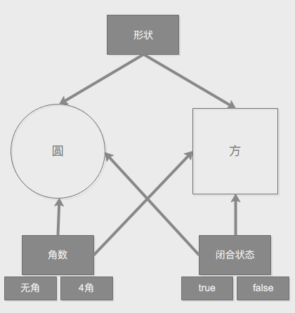

# GNOP

***

<!-- TOC depthFrom:1 depthTo:6 withLinks:1 updateOnSave:1 orderedList:0 -->

- [GNOP](#gnop)
	- [n11p1 最简](#n11p1-最简)
	- [n11p2 logic的结构化](#n11p2-logic的结构化)
	- [n11p3 性能优化](#n11p3-性能优化)
	- [n11p4 logic归纳结构的形成过程（从意识流到logic归纳）](#n11p4-logic归纳结构的形成过程从意识流到logic归纳)
	- [n11p5 change的形成](#n11p5-change的形成)
	- [n11p6 Real-identNode的形成](#n11p6-real-identnode的形成)
	- [n11p7 RIN的形成2](#n11p7-rin的形成2)
	- [n11p8 RIN的网络化](#n11p8-rin的网络化)
	- [n11p9 用信息域和集合定义的方式表示结构](#n11p9-用信息域和集合定义的方式表示结构)
	- [n11p10 RIN的网络化2](#n11p10-rin的网络化2)
	- [Other](#other)

<!-- /TOC -->

## n11p1 最简
`CreateTime 2018.02.03`

| 前言 >> |
| --- |
| 本节,为找到未能最简化的设计,并进行改良; |

***

| 删AILine >> |
| --- |
| 去掉AILine,由AIPort来替代;`参考当天代码;` |

***

| 删AIChangeNode,AILogicNode >> |  |
| --- | --- |
| 命题: | 关于删除AIChangeNode,AILogicNode的思考 |
| 分析: | 时间产生了动,动产生了变化,产生了逻辑 |
| 核心起因: | 去掉AIChangeNode,变化由静态数据表示,不会是正确的方式; |
| 命题起因: | 1. change和logic并非最简设计; 2. 关于时间时序的知识表示未能完美解决 |
| 问题点: | 1. 不能因时序产生大量数据; 2. 不能因时序破坏原有网络结构 |
| 入口: | 从cmv的变化入手,changeNode确有必要,即真实的结构为:`定义->属性->值->变化` |
| 知识表示: | changeNode有时应体现在absNode上,作为changeNode存在,因为具象信息有明确值 |
| 注: | 先后,from表示先,to表示后; |
| 结果: | changeNode和logicNode删除失败,但需要改进 |

| logic的知识表示问题 >> |  |
| --- | --- |
| 命题: | logic需要横跨node;所以logic要么单独设计表示方式,但又不能脱离原有"归纳网络" |

|  |
| --- |

***

| 删除thinkDeep和shallow,合为1 >> |
| --- |
| mv激发的能量值已经说明了一切,没有mv无法形成思维循环,只有很弱的`能量值`,所以不需要deep和shallow |

     

## n11p2 logic的结构化
`CreateTime 2018.02.04`

| logic >> |  |
| --- | --- |
| 介绍 | change因logic才有了意义,而logic依附于`归纳网络`中,所以有了各种复杂的问题解决能力 |
| 生成原则 | 与其它node类似,只有think想到的才会产生关联,而shallowThink弱,deepThink强关联 |

     

## n11p3 性能优化
`CreateTime 2018.02.04`

| 性能优化 >> |
| --- |
| 1. 按dataType分维存储(以`dataType`和`dataSource`和`值`为索引,快速定位到指定维) |

     

## n11p4 logic归纳结构的形成过程（从意识流到logic归纳）
`CreateTime 2018.02.26`

| 前言 >> |
| --- |
| 以change到logic的结构形成，并非由无数change触发,而是由mv与思维构建。故本节深入思考:由意识流到`类比思维处理`成`logic结构化`的过程。将`change触发`改为由`mv触发`并解决其中几个难点;(参考下文) |

***

| 意识流 >> |
| --- |
| 在thinkingControl中有longCaches来存储所有思维处理过的`信号序列`; |

***

| logic结构化 >> |
| --- |
| logic结构化由`类比思维`形成,并由`changePorts`和`logicPorts`知识表示; |

***

| 示图 >> |
| --- |
|  |
| 1. change在哪一层级(杯子的高度变化,还是仅高度的变化,或是仅值的变化) |
| 2. logic的存储与读出,精确无歧义(知识表示不能脱离`归纳结构`网络) |
| 3. 依赖`思维类比`而构建 |

     

## n11p5 change的形成
`CreateTime 2018.02.27`

| 形成条件 >> | change必须依附在某node对象实例上; |
| --- | --- |
| 知识例1 | A的手长56->变为66 |
| 示图 |  |
| 知识例2（思考） | 1. A的手会变长; 2. B的也会; 3. 所有人都会; 4. 除了C |

***

| 形成步骤 >> |  |
| --- | --- |
| 1 | imv |
| 2 | `假设每个字符串输入都是一个真实世界对象` algsStr时 |
| 3 | 到网络中作唯一性判定,找到`对应Node`(依附对象) |
| 4 | 观察输入的algDic的value变化 |

     

## n11p6 Real-identNode的形成
`CreateTime 2018.02.27`

| 概念 >> |
| --- |
| 在input.algs中;将algDic输入,但algsDic只是针对algs的Model,而并不是真实世界的对象,所以真实世界的对象`Real-identNode`,由thinking根据law形成; |
| RIN基于algsDic的kv;但由thinking类比的law所构建;故:RIN是原始数据的发酵与升华; |

***

| 对象边界的判定难易度 >> | 算法值的复杂度决定判定难易度 |
| --- | --- |
| 1 | 在字符串、imv等输入上，很容易判定其“对象边界”。 |
| 2 | 在图片、音频等上，不容易判定其“对象边界”。 |

***

| 对象边界的判定方式 >> | 本质上是对"值"的类比规律判定 |
| --- | --- |
| 1 | 对字符串，使用字符串切割为char算法即可 |
| 2 | 对imv，使用type判定即可 |
| 3 | 对图片，借助边缘检测，材质等算法进行辅助 |
| 4 | 对音频，使用对应算法，类比判定即可 |

     

## n11p7 RIN的形成2
`CreateTime 2018.02.28`

| 模糊性 >> |
| --- |
| RIN的边界是模糊的,因为思维从来只为其类比结果运作与事务,所以边界不会特别清晰; |

***

| 作用 >> |
| --- |
| RIN是algsDic产生Thinking定义的方式 |
| RIN对智能、性能优化等有重大意义。 |
| RIN直接面向思维的数据 |
| algsDic到RIN是第一次零散到整体; |

***

| algsDic是RIN养料 >> |
| --- |
|  |
| 注: 本图明确划分了:哪些应该由algs完成,而哪些应该由thinking类比; |
| 例: 你不能通过怒吼吓跑蚊子,但可以通过扰乱空气达到目的; |

     

## n11p8 RIN的网络化
`CreateTime 2018.03.01`

| 概念 >> |
| --- |
| 从RIN定义到其结构化为归纳网络,Thinking以此决定了Node间的关联; |
| 故本节重点研究前额叶数据的`从定义到结构化`; |

***

| 先后天属性 >> |
| --- |
| algsDic中的某个key为先天属性; |
| 先天属性有值,经比较后,产生的定义为后天属性; |
| ​先天属性：颜色（algsValue） |
| 后天属性：胳膊（包含关系） |
|  |

***

| 思考 >> |  |
| --- | --- |
| Q: | 类比的过程 |
| A: | `类比结果` -> `Law` -> `大小(后天属性)` -> `三生万物(要保证万物的结构化)` |
| Q: | 当没有了algsDic的故有结构,属性如何形成? |
| A: | 类比相同为抽象,类比异同为属性; |
| Q: | (代码只能写到三,但要保证万的结构化)如何保证? |
| A: | 考虑改进现在AINode结构(4大ports结构),即:再简化;`参考n11p9` |

***

| 示图 >> |
| --- |
|  |
| 一条知识示图,辅助思考从 1. 类比 2. 到Law 3. 再到后天属性 4. 后天定义 5. 再到结构化; |

     

## n11p9 用信息域和集合定义的方式表示结构
`CreateTime 2018.03.02`

| 简介 >> |
| --- |
| 以absPorts和pptPorts等的方式,无法实现"自然而然的结构化";并且以abs和ppt为起点,是思维定式使然,并未从简至繁的思考; |
| 故:本节试图通过信息域的方式,以类比到规律的"集合定义",来思考归纳网络的生成; |

***

| 示图 >> |
| --- |
|  |
| PIN的data是一个array; |

***

| 生成第一个RIN-代码例 >> |
| --- |

|  |  |
| --- | --- |
| 1 | 输入"imv"与"字符串"时,将思考到的存起来(algsDic作为事务参数就算事务结果为nil也会存) |
| 2 | 再次输入"imv"时,便有了联想与类比; |
| 3 | 初次类比的目的仅是找出信息集合,并进行定义 |
| 4 | 完成 |
| 注 | 整个过程与时间赛跑,因为GC会用进废退 |

***

| 完全以类比的结果为依据创建结构化网络; >> |
| --- |
| 1. 单纯找到规律并定义,与当下的统计学方式无区别 |
| 2. 而后续的用进废退,与当下的alphaGoZero的强化学习也无明显区别 |
| 3. 而不同在于;下表 >> |

| 动态构建结构网络 的独特 >> |
| --- |
| 1. 通过最简单的类比,表示真实世界的游戏规则 |
| 2. 用归纳结构网络作表示所有知识;(灵活模糊等特性) |
| 3. 用自由的思维作构建者 |
| 4. 用mv作思维的最简规则 |
| 5. 用law打通由细分到抽象的纵向通路;(本节思考部分) |
| 6. RIN部分的归纳网络完全由思维说了算,无代码干预(本节思考部分,找到这个边界`代码与非代码各处理哪些`) |

***

| 避免构建重复内容 >> |
| --- |
| 1. 包含关系:当从定义中,再找到定义时,如何构建关联? |
| 2.  |

     

## n11p10 RIN的网络化2
`CreateTime 2018.03.05`

| 思考`RIN到网`的方式 >> |  | 原因 |
| --- | --- | --- |
| 1. 从GNOP和OOP出发 | 错 | 以结果推结果 |
| 2. 从代码实现出发 | 对(50%-100%) | 从细 |
| 3. 从自省,心理学出发 | 对(0%-50%) | 从简 |

| 状态表示 >> |
| --- |
|  |

     

## Other

| toDoList >> | task | status |
| --- | --- | --- |
| 1 | 对各种dataSource的记录;(将mvCharge和mvHunger信号处理后类型分开) | T |
| 2 | 对各种change,用潜意识流logic串起来; |  |
| 3 | 对导致cmv变化的change,进行类比缩小范围; |  |
| 4 | 对缩小范围的change用显意识流logic串起来; |  |
| 5 | 对全局检索进行优化:`分dataType,分dataSource,然后将归纳网络挂到下面` | T |
| 6 | 加上能量值 |  |
| 7 | 并且将`port强度`写完善 |  |
| 8 | 然后将`ports默认排序` |  |
| 9 | 测试一次thinking循环的性能 |  |
| 10 | 合并deep和shallow | T |
| 11 | 第二信号传入 | T |
| 12 | 第二信号的input | T |
| 13 | 第二信号的change |  |
| 14 | 形成一个RIN定义`如:你好` |  |

     
