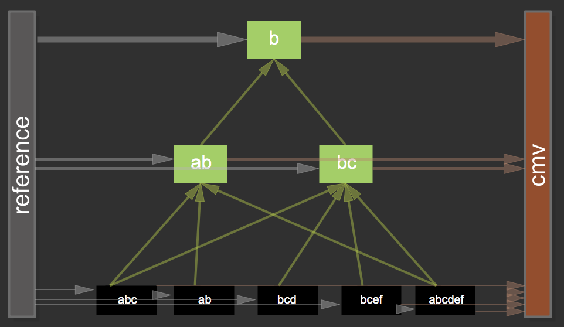

# 宏微是相对的(思维方式)

> 早在note3时,已有关于后天思维方式(三维架构)的想法,而关于思维方式的思考也未曾断过;
>
> 1. 宏微,看似只有一层,其实没有明确界线,宏微是相对的;
> 2. 并且相对宏微对构建网络,及后天思维有致关重要的作用;
>
> 那么:
> 1. 相对宏微如何影响网络构建呢?
> 2. 如何融入cmv模型?
> 3. 如何被前额叶使用呢?
> 4. 如何与mv融合呢?
> 5. 如何与net融合呢?
> 6. 如何形成后天思维方式呢?
>
> note13主要面对这些问题而展开;

***

<!-- TOC depthFrom:1 depthTo:6 withLinks:1 updateOnSave:1 orderedList:0 -->

- [宏微是相对的(思维方式)](#宏微是相对的思维方式)
	- [n13p1 思考思维方式之相对宏微](#n13p1-思考思维方式之相对宏微)
	- [n13p2 cmvRule](#n13p2-cmvrule)
	- [n13p3 从节点复杂度,思考网络优化](#n13p3-从节点复杂度思考网络优化)
	- [n13p4 output](#n13p4-output)
	- [n13p5 后天思维之thinkFeed](#n13p5-后天思维之thinkfeed)
	- [n13p6 相对宏微之网络改版](#n13p6-相对宏微之网络改版)
	- [n13p7 相对宏微之代码实践](#n13p7-相对宏微之代码实践)
	- [n13p8 smg总结](#n13p8-smg总结)
	- [Other](#other)

<!-- /TOC -->

     

## n13p1 思考思维方式之相对宏微
`CreateTime 2018.06.06`

| 思维方式的重要性 >> |
| --- |
| 1. 思维方式是否只是cmv模型,在absNode间的宏观体现 |
| 2. 1种答:如果是则AGI智能体现远超人类,如果否则AGI与人类在同一量级 |
| 3. 2种答:在数据因果复杂度上,可同时分析的信息数是有限的;这个平衡点,制约着智能值; |

 

| 宏微界线 >> |
| --- |
| 1. 宏微的界线没有那么明确，每个节点的微信息组,都是微。 |
| 2. 宏微是相对的,(索引与node相对) |
| 3. 宏微是相对的,(类比单位为微，抽象区域为宏。) |

 

| 组与分 >> |
| --- |
| 1. 解决集合(组)的问题，而不仅是分。(foOrders为组，absNode为分) |

 

| 开发 >> |
| --- |
| 1. shortCache里加上absNode。 |
| 2. shortCache里加上思维log (thinkFeed)。 |

 

|  |
| --- |
| 红线:宏信息中的`微信息组`,也作为`微信息`;以指针形式存在absIndex中, |
| 再由,absReference排序其引用强度; |

     

## n13p2 cmvRule
`CreateTime 2018.06.07`

| 示图 >> |
| --- |
|  |
| `黑: foOrders` `棕: cmv` `灰: reference` `绿: absNode` |

 

| 问题 >> |  |
| --- | --- |
| 1 | 充电mv和饥饿状态mv是两个 |
| 2 | 饿了想吃东西,还是想变饱? |
| 3 | 饿状态即urgentValue |

 

| 理论 >> |  |
| --- | --- |
| 1 | 一mv两面 (阴阳转化) |
| 2 | 因果 (状态是因,变化是果) |

 

| 归纳分类 >> | 痛 | 饿 | 欲 |
| --- | --- | --- | --- |
| urgentValue | 痛感越高越迫切 | 饥饿感越高越迫切 | 越少越迫切 |
| targetType | 消除痛感 | 消除饥饿感 | 变多 |
| 状态 | 疼痛值 | 饥饿值 |  |
| 变化 | 舒服或平静中和痛感 | 充电中和饥饿感 |  |

     

## n13p3 从节点复杂度,思考网络优化
`CreateTime 2018.06.11`

| 前言 >> |
| --- |
| 1. 集合note12所实践的四序列,思考一下网络结构上有没有可优化简化的地方: |

 

|  |
| --- |
| 注: `i=index` `is=indexs` `abs=abstract` `fon=frontOrderNode` |
| 1. foNode: 多对一 `多微信息 对 cmvModel` |
| 2. cmvModel: 一对一 `foNode 对 cmvNode` |
| 3. cmvNode: 一对二 `cmvModel 对 targetType_p和urgentValue_p` |

     

## n13p4 output
`CreateTime 2018.06.12`

| 行为学习 >> |
| --- |
| 1. 反射输出 |
| 2. 尝试输出 |
| 3. 输出log入网 |
| 4. 运用output网 |

 

| 理论步骤 >> |  |  |
| --- | --- | --- |
| 1 | outputAlgs算法层 | 定义了输出算法 |
| 2 | 反射输出 | imv与输出的反射回路 |
| 3 | omv与反射输出入网 |  |
| 4 | 尝试输出 | 决策,上升到后天输出阶段 |
| 5 | 输出入网 | 上升到后天输出的学习阶段 |
| 6 | 运用output网输出 |  |

     

## n13p5 后天思维之thinkFeed
`CreateTime 2018.06.12`

| 问题 >> |
| --- |
| 1. thinkFeed什么时候被mv带给foNode? |
| 2. 本文思考找到:后天思维的哪部分是规则化,代码化的,流程化的;从而找到思维方式的代码实现方式; |
| 3. 思考是否`组分(相对宏微)`是形成后天思维的先决条件,或唯一条件; |

 

| 正文 >> |  |
| --- | --- |
| 1 | thinkFeed只是后天思维的第一步; |
| 2 | 思维解决问题也是构建网络,如 `练题成考神`,`自省使抽象加抽或入cmvModel` |

 

| 步骤 >> |  |
| --- | --- |
| 1 | input |
| 2 | noMV |
| 3 | shortCache |
| 4 | assData |
| 5 | thinkFeed |

 

| 问题 >> |  |
| --- | --- |
| 1 | thinkFeed应该存哪些指针? 如何分辨抽象知识的整体性? |
|  | 答:在thinking中`新参与类比的`或`新构建的`指针,抽象知识的整体性在网络中; |
| 2 | thinkFeed不应该是序列;而是网络的吗?如何存储使用? |
|  | 答:元素是指针,网络还是在net中; |
| 3 | thinkFeed确定也以cmvModel的方式传输给网络吗?为什么? |
|  | 答:是,因为thinkFeed所指向的absIndex也是微信息,需要与分信息混合传入,以形成自由的组分结构; |
| 4 | 第3如果是,怎么传?与shortCache的区别是什么? |
|  | 答:考虑：1、 shortCache（4-7不区分input和ass） 2、thinkFeed（快速优先检索区） |
| 5 | 感觉缺了些什么,例如:shortCache如果不区分input和ass,那么序列呢?如何排先后; |
|  | 答: shortCache的上升是不需要回头的,其存储的对象向来就是指针,指针指向什么取决于网络;这也符合思维源于网络的特性 (但有个矛盾点是目前的shortCache其实存的是微信息,并非宏信息) |

     

## n13p6 相对宏微之网络改版
`CreateTime 2018.06.22`

| 简介 >> |
| --- |
| 宏微是相对的,导致原先明确的索引层不再明确;索引必须全面铺开到网络中; |
| 而shortCache的相对宏微,也必然要求shortCache永远只存宏信息; |

 

| 正文 >> |  |
| --- | --- |
| 1. 索引改版 | 数据即索引不变,凡网络节点的数据皆索引;无明确的索引层,每层都是其抽象层的索引; |
| 2. shortCache改版 | 关于`识别阶段`与`思维阶段`的shortCache存宏微信息矛盾;将识别阶段也生成宏节点,故shortCache只存宏信息; |

 

| 示图 >> |
| --- |
|  |
| 注: 数据索引部分,从分向组方向升级,而升级的依据是网络节点 |
| 注: 网络节点部分,从组向分方向抽象,而抽象的依据是数据规律 |
| 注: 所有的模糊组信息,都由shortCache提供; |

 

| 代码实践 >> |  |
| --- | --- |
| 1 | 只需要把shortCache中微信息的装箱操作,再装一步,装到node中; |
| 2 | 索引可还用目前这种,分界还算是特别分明的 |

     

## n13p7 相对宏微之代码实践
`CreateTime 2018.06.25`

| shortCache >> |  |
| --- | --- |
| 1 | shortCache的所有元素都是微指针 |
| 2 | shortCache的长度是否决定智力 |
| 3 | shortCache决定了cmvModel前因序列的长度,及整个网络的构建过程、结果和复杂度。 |

 

| shortCache存哪些微信息 >> |  |
| --- | --- |
| 1 | algsArr_Index; `输入微信息` |
| 2 | absIndex; `抽象微信息` |
| 注 | 所有宏信息的检索,也是构建抽象的过程,或者指向已存在抽象的过程;所以将abs后的absIndex加到shortCache是必然的,以形成螺旋组分; |

     

## n13p8 smg总结
`CreateTime 2018.06.26`

 

| 简介 >> |
| --- |
| 1. smg目前的情况,完成相对宏微后,能够实现什么样的智能效果,如何训练及呈现? |
| 2. 本节针对,smg的系统现状,作些训练及智能体现方面的思考; |

 

| 明日提示 >> | title | desc |
| --- | --- | --- |
| 1 | output | omv应激反应输出。 |
| 2 | sames | 把前因序列类比出的sames也改成时序的。(避免逻辑混乱) dataIn是流式输入;sames也是基于当前输入信号与shortCache已有信号,可进行组合检索的; |
| 3 | assData | 完善thinking中无mv的assData流程; |
| 4 | thinkFeed | noMV的dataIn流程,在联想后,依然noMV,但联想的结果要入到cacheThinkFeed里; `写thinkFeed` |
| 5 | foundation | 将pointer,缓存,port,等封装一下,使用时更简单些;代码也更易读些; |
| 6 | absCmvNode | 写mindValueRule 或许不需要cmvRule,而是类比cmvModel;抽象cmvNode; `写cmvNode的抽象` |
| 7 | checkMV | 往checkMV中,加上change的部分,并改cmvNode; |

     

## Other

| toDo >> | task | status |
| --- | --- | --- |
| 1 | 删除absNode下的refs_p, | T |
| 2 | 创建absReference | 复用indexReference |
| 3 | 测试absNode的index和reference; | T |
| 4 | 思考absPort和conPort的n对n关系; `太过复杂的关系,是否影响其它,或者造成性能问题` `如果要简化为1对n关系,那应该如何优化网络` `思: n对n关系,说明一个问题,就是要么多了关联,要么少了节点;` | 问题升级,参:n13p3 |
| 5 | 关于cmvModel的:orders,foNode,cmvNode四者分开,还是哪些到一起? | T |

     
