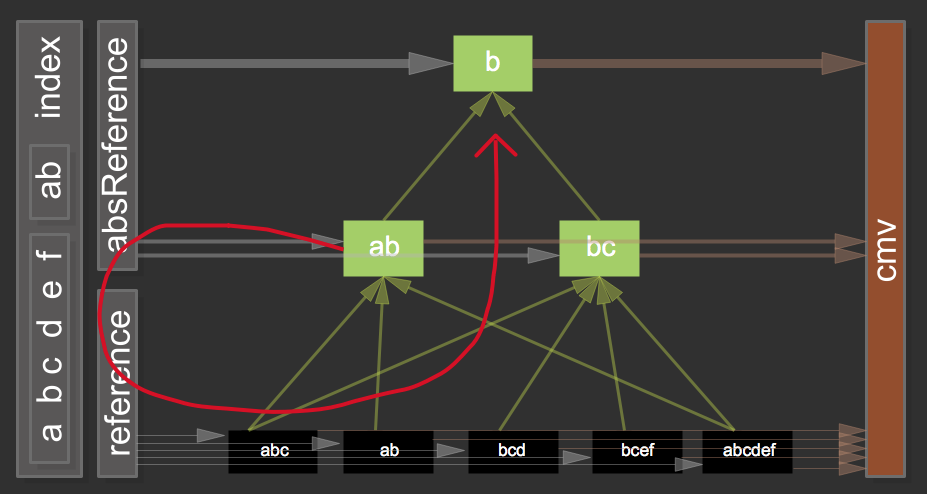
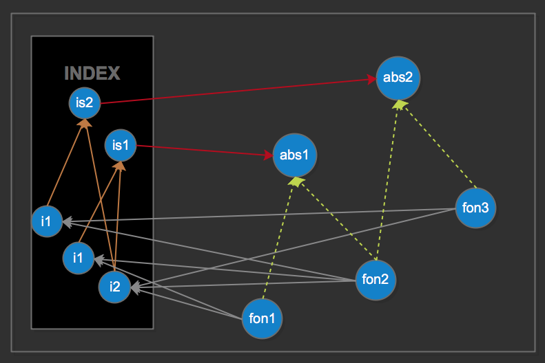

# 宏微是相对的(思维方式)

> 早在note3时,已有关于后天思维方式(三维架构)的想法;
>
> 宏微,看似只有一层,其实界线便没有那么明确,与网络一样,是不限层的;
>
> 那么这一层:
> 1. 如何构建呢?
> 2. 如何融入cmv模型?
> 3. 如何被前额叶使用呢?
> 4. 如何与mv融合呢?
> 5. 如何与net融合呢?
> 6. 如何形成后天思维方式呢?
>
> note13主要面对这些问题而展开;

***

<!-- TOC depthFrom:1 depthTo:6 withLinks:1 updateOnSave:1 orderedList:0 -->

- [宏微是相对的(思维方式)](#宏微是相对的思维方式)
	- [n13p1 思考思维方式之相对宏微](#n13p1-思考思维方式之相对宏微)
	- [n13p2 cmvRule](#n13p2-cmvrule)
	- [n13p3 从节点复杂度,思考网络优化](#n13p3-从节点复杂度思考网络优化)
	- [n13p4 output](#n13p4-output)
	- [n13p5 后天思维之thinkFeed](#n13p5-后天思维之thinkfeed)
	- [Other](#other)

<!-- /TOC -->

     

## n13p1 思考思维方式之相对宏微
`CreateTime 2018.06.06`

| 思维方式的重要性 >> |
| --- |
| 1. 思维方式是否只是cmv模型,在absNode间的宏观体现 |
| 2. 1种答:如果是则AGI智能体现远超人类,如果否则AGI与人类在同一量级 |
| 3. 2种答:在数据因果复杂度上,可同时分析的信息数是有限的;这个平衡点,制约着智能值; |

 

| 宏微界线 >> |
| --- |
| 1. 宏微的界线没有那么明确，每个节点的微信息组,都是微。 |
| 2. 宏微是相对的,(索引与node相对) |
| 3. 宏微是相对的,(类比单位为微，抽象区域为宏。) |

 

| 组与分 >> |
| --- |
| 1. 解决集合(组)的问题，而不仅是分。(foOrders为组，absNode为分) |

 

| 开发 >> |
| --- |
| 1. shortCache里加上absNode。 |
| 2. shortCache里加上思维log (thinkFeed)。 |

 

|  |
| --- |
| 红线:宏信息中的`微信息组`,也作为`微信息`;以指针形式存在absIndex中, |
| 再由,absReference排序其引用强度; |

     

## n13p2 cmvRule
`CreateTime 2018.06.07`

| 示图 >> |
| --- |
|  |
| `黑: foOrders` `棕: cmv` `灰: reference` `绿: absNode` |

     

## n13p3 从节点复杂度,思考网络优化
`CreateTime 2018.06.11`

| 前言 >> |
| --- |
| 1. 集合note12所实践的四序列,思考一下网络结构上有没有可优化简化的地方: |

 

|  |
| --- |
| 注: `i=index` `is=indexs` `abs=abstract` `fon=frontOrderNode` |
| 1. foNode: 多对一 `多微信息 对 cmvModel` |
| 2. cmvModel: 一对一 `foNode 对 cmvNode` |
| 3. cmvNode: 一对二 `cmvModel 对 targetType_p和urgentValue_p` |

     

## n13p4 output
`CreateTime 2018.06.12`

| 行为学习 >> |
| --- |
| 1. 反射输出 |
| 2. 尝试输出 |
| 3. 输出log入网 |
| 4. 运用output网 |

     

## n13p5 后天思维之thinkFeed
`CreateTime 2018.06.12`

| 问题 >> |
| --- |
| 1. thinkFeed什么时候被mv带给foNode? |

 

| 明日提示 >> |  |
| --- | --- |
| 1 | 关于cmvModel的:orders,foNode,cmvNode四者分开,还是哪些到一起? |
| 2 | 写mindValueRule |
| 3 | 写cmvNode的抽象 |
| 4 | omv应激反应输出。 |
| 5 | 把前因序列类比出的sames也改成时序的。(避免逻辑混乱) dataIn是流式输入;sames也是基于当前输入信号与shortCache已有信号,可进行组合检索的; |
| 6 | 完善thinking中无mv的assData流程; |
| 7 | noMV的dataIn流程,在联想后,依然noMV,但联想的结果要入到cacheThinkFeed里; |
| 8 | 写thinkFeed |

     

## Other

| toDo >> | task | status |
| --- | --- | --- |
| 1 | 删除absNode下的refs_p, | T |
| 2 | 创建absReference | 复用indexReference |
| 3 | 测试absNode的index和reference; | T |
| 4 | 思考absPort和conPort的n对n关系; `太过复杂的关系,是否影响其它,或者造成性能问题` `如果要简化为1对n关系,那应该如何优化网络` `思: n对n关系,说明一个问题,就是要么多了关联,要么少了节点;` | 问题升级,参:n13p3 |

     
