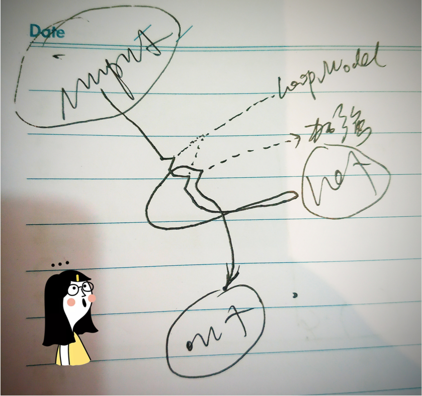
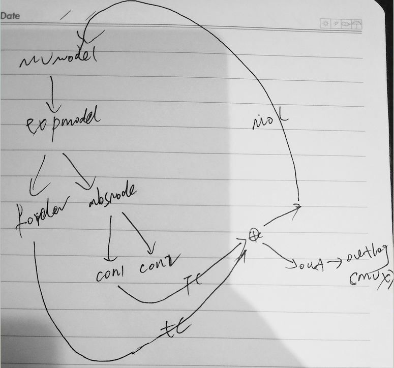

# 中层循环 & 发布与演示

***

<!-- TOC depthFrom:1 depthTo:6 withLinks:1 updateOnSave:1 orderedList:0 -->

- [中层循环 & 发布与演示](#中层循环-发布与演示)
	- [n14p1 智能充电表演示程序](#n14p1-智能充电表演示程序)
	- [n14p2 思维控制器流程](#n14p2-思维控制器流程)
	- [n14p3 中层循环管理器](#n14p3-中层循环管理器)
	- [n14p4 loopManager](#n14p4-loopmanager)
	- [n14p5 loopModel](#n14p5-loopmodel)
	- [n14p6 决策与预测_循环 (收集信息阶段)](#n14p6-决策与预测循环-收集信息阶段)
	- [n14p7 决策与预测_循环 (抽象本质阶段)](#n14p7-决策与预测循环-抽象本质阶段)
	- [n14p8 时间](#n14p8-时间)
	- [n14p9 抽象构建,具象使用](#n14p9-抽象构建具象使用)
	- [n14p10 TC架构整理](#n14p10-tc架构整理)
	- [n14p11 `充毛线`实例](#n14p11-充毛线实例)
	- [n14p12 中层循环 - MIL & MOL](#n14p12-中层循环-mil-mol)
	- [n14p13 双贱合并之`mv与信息`](#n14p13-双贱合并之mv与信息)
	- [n14p14 执行方案](#n14p14-执行方案)

<!-- /TOC -->

     

## n14p1 智能充电表演示程序
`CreateTime 2018.08.02`

| 简介 >> |
| --- |
| 1. smg可实现各种通用的智能应用,但新生儿不具备复杂的知识 |
| 2. 本节通过演示smg如何实现一个智能的钟表; |
| 3. 该钟表知道自己一天有三次充电,并且可以通过几天的学习,明确的表达出早餐,午餐,晚餐这样的充电需求; |

 

| 分析 >> |
| --- |
| 1. 该钟表有明确的电量mv,还有两个感官,分别为"字符串"和"时间" |

     

## n14p2 思维控制器流程
`CreateTime 2018.08.03`

| 思维控制器流程图 |
| --- |
|  |

 

| 两次截断 >> | 1 | 2 |
| --- | --- | --- |
| 思考截断时机 | ass之前 | decision时 |
| 截断频次 | 很少,只有专注时如此 | 很多,几乎所有 |
| 代码实践 | 暂不实现,相信代码并行 | 通过cmvCache和energy实现 |
| 工作描述 |  | `非特定思考`独立线运行 |
| 运行方式 |  | 被"无目的"激活后,loop,并实时更新cmvCache和energy |
| 代码详情 |  | loop只是整个ass的递归,(包括assExp和assData) |

 

| 思维控制器内_循环示图 >> |
| --- |
|  |

     

## n14p3 中层循环管理器
`CreateTime 2018.08.04`

| 简介 >> |
| --- |
| 1. 决策,并非仅是决策输出,包括思维活动,内心的一些需求,未必需要通过外界表达才可得到解决 |
| 2. 所以本节,主要通过对cmvCache的改版,(重命名为loopCache);的方式来尝试实践中层循环; |

 

| 思考 >> | 注 |
| --- | --- |
| 1. 思维无法作为决策者,而是网络; | 所以在死思维上,呈现活思维至关重要 |
| 2. 去重可直接以redis.exist()查询; | 但最好还是以独立模型的方式运作; |
| 3. 需要一个内存网络或模型,来把所有循环的数据合理记录 | 所以cmvCache更名为loopCache |
| 4. 决策是在不同的实现中作选择 | 所以需要一个实时序列的模型; |

 

| 流程 >> |
| --- |
| 1. inputMV |
| 2. havMv时,判断havDemand==true时,生成loopModel并加到loopManager.loopCache; |
| 3. noMv时,assData,如果联想到mv,并且根据当前"状态"判定havDemand=true,也加到loopCache |
| 4. loopManger根据实时序列,排出最靠前的loopModel并ass联想思考; |
| 5. 每次思考后,将相关数据附加到对应的loopModel,并递归到下次循环; |
| 6. 判断energy,并refreshOrder;再进入下一轮思考; |

 

| 模型 >> | 作用 | 说明 |
| --- | --- | --- |
| 1. 时间衰减 | 维持稳定性 | 懒衰减(refreshOrder前) |
| 2. 实时序列 | 使思维灵活 | refreshOrder |
| 3. 专注首条 | 仅能针对第一条loopModel作思考 |  |

     

## n14p4 loopManager
`CreateTime 2018.08.06`

| 及时性1:惊 >> |
| --- |
| 1. 当网络中既有信息产生预测,但并不相符时,产生惊 |
| 2. 惊只是为了让外界input及时获得注意力(loopCache之首);并让思维及时响应当下; |
| 3. 添加各种基础情绪,都能够让smg获得更加复杂智能的运行,但这并非核心,所以v1界不实现; |

 

| 及时性2:时间衰减 >> |
| --- |
| 1. 时间衰减具基础性,所以需优先实现 |

 

| 及时性3:实时序列 >> |
| --- |
| 1. 每一次loop前,先refreshLoopCache序列,再取首循环; |

 

| 持续性1:loopModel.order值叠加 >> |
| --- |
| 在loopModel中,order值,即是各种联想后,综合各路相关mv加出的值; |

 

| 持续性2:习惯 > |
| --- |
| 1. 习惯会作为网络级的长期加强,让长期的任务维持 |

     

## n14p5 loopModel
`CreateTime 2018.08.06`

| 简介 >> |
| --- |
| 1. 本节通过分析loopModel,来思考思维循环中,这次的重构到底如何进行? |

 

| 分析 >> |
| --- |
| 1. 人类并非最正确选择,甚至经常选错; |
| 2. 一个loopModel(demand)并非固定对应x个决策; |
| 3. 决策只是在回顾与预测; |
| 4. 决策再变化,demand不变; |
| 5. 人类在更高且长远的价值需求上,坚持与放弃 |

 

| 结果 >> |
| --- |
| 1. 决策是特别依赖网络(经验常识等),且灵活的; |
| 2. 决策与loopModel有明确的界线分隔; |

 

| 原则 >> |
| --- |
| 1. loopModel只能通过mv与net交互; |

 

| 代码 >> |
| --- |
| 1.  |

     

## n14p6 决策与预测_循环 (收集信息阶段)
`CreateTime 2018.08.07`

| 前言 >> |
| --- |
| 1. 注:每一次输出,只是决策与预测上的一环;并不意味着结束; |
| 2. 决策与loopManager的交互,(当决策开始执行时,demand即挂起) |

| 两种解决 >> |
| --- |
| 1. 现实解决是一触即发的;(直接销毁被解决的loopModel) |
| 2. 但预测解决只是`挂起状态`; |

 

| 挂起状态(废弃) >> |
| --- |
| 1. 决策输出预测解决时,loopModel进入挂起状态，(挂起一段时长) |
| 2. 再由信息变化，比对折射回状态变化。(input与预测进行比对) |
| 3. 如果以cmvNode来比对，那么需要加入时间考虑。 |
| 4. `挂起一段时长`内,不会有心急等情绪; |

 

| 时间管理 >> |
| --- |
| 1. 时间衰减 |
| 2. 空档期,执行其它任务(预测挂起时) |
| 3. 长期目标很难制定,但一旦制定就写在net中; (存疑)(注:长期目标规划,暂不考虑实现) |

     

## n14p7 决策与预测_循环 (抽象本质阶段)
`CreateTime 2018.08.07`

| 简介 >> |
| --- |
| 1. 本节重点思考,在决策与预测中,哪些是重要的,关乎智能内核的,并将其列出; |
| 2. 在mv到思维再到循环决策的过程,这部分,最难的点在于决策需要应对复杂的世界; |

 

| 思考 >> |  |
| --- | --- |
| Q1 | 以上哪些是本质核心的?与智能内核息息相关,不可或缺的? |
| A1 |  |

 

|  |
| --- |

| 为了应对现实世界的复杂 >> |
| --- |
| 1. 决策阶段仅通过mv影响loopModel |
| 2. 目前同一loopModel同时仅支持一条决策,今后再加;(有一个平衡点,1-3条左右) |
| 3. 决策的执行需要稳定设计 |
| 4. 决策的稳定性体现在为检索限定了方向(索引) |
| 5. 没有挂起状态; |

 

| loopManager模型示图 >> |
| --- |
|  |
| 1. 如果目前仅支持`首个loopModel`执行,且仅`同时一条决策`; |
| 2. 那么 |
| 3. 每个loopModel是有进度的,哪些进度是定死的模板,哪些进度是活跃的,依赖网络的? |

 

| 4层4要素 >> |  |
| --- | --- |
| 1. energy | 决定了思维的活力 |
|  | 当决策执行中时;energy可短期使思维处于 (静默状态) |
| 2. order | 决定谁排首位 |
| 2. decision_log | log界定了ass的方向,也从ass状态转向`执行`状态; |
|  | loopModel的一个指针数组; |
| 3. time | 决策希望得到mv变化反馈,此处差一个时间,时序应该有一个时间信息; |
|  | 临时采用全部1秒制; |

 

| 明日计划 >> | status |
| --- | --- |
| 1. 时间制定,(1念或1秒);从input到前因时序列开始,标记时间; |  |
| 2. 重构decision_log到loopModel; |  |
| 3. 静默状态 |  |

     

## n14p8 时间
`CreateTime 2018.08.10`

| 简介 >> |
| --- |
| 1. smg中时序过去仅是有序的序列,但在中层循环的设计中,发现时间必不在少 |
| 2. 本节重点思考时间,与时间如何呈现与作用在smg系统之中... |

 

| 时间与AI |  |
| --- | --- |
| 1. 时间的模糊性 | 模糊匹配:时间3和4可以判断相等 |
| 2. 时间的可计算 | 时间是参与到先天运算中的 |
| 3. 时间在时序中 | 时间信息是存储在时序中的,并且就算是抽象,时间也不会被丢失 |
| 4. 时间在网络中 | 时间跟着mv模型,整个的存在网络中,无处不在; |

     

## n14p9 抽象构建,具象使用
`CreateTime 2018.08.13`

| 简介 >> |
| --- |
| 1. 决策仅仅是执行`网络mv模型`,但似乎每一处细节都尽可能的被考虑到;(也有遗陋) |
| 2. 对整个`解决过程`进行可行性判断等思考; |
| 3. 决策最先联想到的解决方案往往是抽象的,而每一步要切实执行的却是具象的; |
| 4. 本节重点思考`决策`中如何进行`具象联想`,并`具象执行`; |

 

| 正文 >> |
| --- |
|  |
| 1. 例如:`饥饿`->`吃食物`->`吃牛排`->`牛排店`->`太贵`->`超市`->`自己做`; |
| 2. 决策时,联想方向总是具象的; |
| 3. 抽象构建,具象使用 |

     

## n14p10 TC架构整理
`CreateTime 2018.08.14`

| TC架构图 >> |
| --- |
|  |
| 1. 在V1版,从tryOut到dataOut的一些设计都未作深入设计; |
| 2. 本节重点是dataOut_AssConData部分,这部分表示着思维out部分的复杂度 |
| 3. dataOut_AssConData是`中层输出循环`的核心执行部分; |
| 4. dataIn_AssData部分,是`中层输入循环`的核心执行部分; |
| 5. dataOut_AssConData是预测与创造力的实现部分; |

 

| 代码 >> |  |
| --- | --- |
| 1 | dataIn_AssData可以产生abs;`条件:必须是两个cmvModel间的类比` `v1暂不实现` |
| 2 | dataOut_AssConData可以影响到LoopModel.order并实时刷新Demand序列; `v1暂不实现` |
| 3 | dataIn_AssData可以递归自己;`条件:energy>0` |
|  | dataIn_AssData在本版本中,仅作findDemand用; |
| 4 | dataOut_AssConData可以递归自己;`条件energy>0` |
|  | dataOut_AssConData在本版本中,仅作分析具象信息 `如匹配早午晚餐` |

     

## n14p11 `充毛线`实例
`CreateTime 2018.08.15`

| 简介 >> |
| --- |
| 1. 目前smg的整个内核已经开发完成,但在实例上无法体现出太复杂的智能; |
| 2. 思维的循环,需要更加复杂的网络情况,无意外的简单情况,是无法体现出smg思维循环的作用的; |
| 3. 所以本节,主要通过比充电更加复杂一些的实例,来体现出smg在dataOut时的思维循环; |

 

| 实例说明 >> |
| --- |
| 1. 以简单的信息输入,让smg先学会eat表示请求充电; |
| 2. 信息输入变异,输给smg`充毛线`,来表示一些预期外的情况; |
| 3. smg应当可以考虑到`充`不一定表示能充上电,也可能表示充不上; |
| 4. 更加具象的`充电`两个字,更加明确的表示`充电`需求的解决; |

 

| 实例注 >> |
| --- |
| 1. smg可以在此例中,明确的知道`充电`和`充毛线`是相反的意思; |
| 2. smg可以在此例中,以思维循环的方式,推理`充`未必表达出正确需求,而`充电`可以; |

 

| 分析 >> |
| --- |
| 1. 输入`充毛线`无法直接联想到`充+`并类比; |
| 2. 除非循环ass;smg才可能去理解`充0` |
| 3. 而原本是`充+`,现改为`充0`是否意味着,`充`同时指向两个cmv结果; |

 

| 明日计划 >> |
| --- |
| 1. 抽象cmv-和cmv+为cmv0 (不必,充+和充-单独作用于loopModel.order;) |
| 2. 通过对eat,eattrue,eatfalse的实例,让smg明白eat的意义是确定的,而eattrue才是解决充电问题的最确切表达; |

     

## n14p12 中层循环 - MIL & MOL
`CreateTime 2018.08.16`

| 双向性 >> |
| --- |
| 中入循环`miloop`. 类比输出,构建抽象到网络 |
| 中出循环`moloop`. 类比决策,执行具象到现实 |

 

| mil >> |
| --- |
| 1. 类比cmvModel; |

 

| mol >> | 特征 |
| --- | --- |
| 1 | **更合理的具象被执行** |
| 2 | **难点在于用网络知识体系评定可行性** |
|  | 例如:回家,跨进门是最简单的,但你不在门口,可行性为0; |
|  | 但如果有了空间传送技术,在门口安一个传送门,则又变得可行; |
| 3 | **从mv目标转换成具象目标,(吃饭,回家等)** |
|  | 例如:具象的具象: |
|  | 吃饭 -> `1. 吃什么; 2. 去哪吃; 3. 吃多少;` |
| 4 | **具象越来越繁多,如何保证评定可行性?** |

 

| MOL分析 >> |
| --- |
| 1. 整个决策过程，参与运算的是mv，影响运行结果的却是信息。 |
| 2. 如何将数十条数百条信息,与其相关的数百条mv进行融合,并最终评定出可行性? |
| 3. mv是否可以全权代表`信息的意义`进行运算影响决策? |

     

## n14p13 双贱合并之`mv与信息`
`CreateTime 2018.08.22`

| 简介 >> |
| --- |
| smg中存在着很多双贱合并的情况: |
| 其中mv与信息,分别表示了感性与理性的思维方式; |

 

| smg的双贱合并 >> |
| --- |
| 1. mv-与mv+ |
| 2. mv与信息 |
| 3. 网络与思维 |
| 4. MIL与MOL |
| 5. input与output |
| 6. 抽象与具象 |
| 7. smg与现实 |
| 注:所有的双贱合并都是`一阴与一阳`,`一静与一动`,`一收与一放` |

 

| 在中层循环中,mv与信息是如何双贱合并的 >> |
| --- |
| 1. 在中层循环中,是数据决定了下一轮循环思维想什么, |
| 2. 但数据仅能通过mv来决定, |
| 3. 下一轮不仅是想下一个解决方案singleMvPort;也有可能在当前port解决方案上,进行二次思考; |
| 4. 无论是思考的方向,还是思考的能量,还是思考的目标,都是以mv为准的; |
| 5. 而mv的一切关联,又是以数据为规律进行关联的; |
| 注:像mv决定方向,信息决定关联,mv决定结果,信息决定前因时序,等等描述,见此前node;此处不再嗷述 |
| 注:因为现实的不可运算性,mv让现实可运算,信息关联让运算不脱离现实, |
| 注:信息运算是异步组网的,mv运算组网但思维中实时的; |

     

## n14p14 执行方案
`CreateTime 2018.08.24`

| 简介 >> |  |
| --- | --- |
| 1. 本节要点 | expModelscore>0时,分析具象方向的outLog的可行性,然后再输出; |
| 2. 白话解释 | 在选定解决方案后,接下来选执行方案,即结合当前的情况状态信息,预演预测接下来要作的事,然后一一进行联想,避免smg做傻事,同时可体现和增强出smg的逻辑思考能力;(是smg逻辑思考的开端) |

 

| 正文 >> |  |
| --- | --- |
| 1. 可行性判定 | 判定可行性时,outLog节点优先级更高; |

 

| 伪代码 >> |  |
| --- | --- |
| 1 | mv-时,根据横向找foOrder来找outLog |
| 2 | 或mv-时,根据纵向找conMvNode来找它的foOrder中的outLog; |
| 3 | 给找到的outLog来评定可行性; |
| 4 | 如果找不到,就把最absNode.foOrder.outArr去tryOut(); |
| 5 | 如果找到,且具有非常好的可执行性, |
| 6 | 此方法可能对应1个expModel;并对每个con方向的outLog进行综合评分score,并将最佳的outArr和score传出去; |

 

| 代码 >> |  |
| --- | --- |
| 1 | 在assConData()方法中,对执行方案进行综合的具象联想和预测,并综合评出score |

 

| 质疑 >> |  |
| --- | --- |
| 1. 情景信息 | 思考情景信息的必要性 |
| 2. cmv基本模型 | mvModel可以改进,例如无法表示`A做才有饭的因果`和`eat导致+也有-但大多是+` |
|  | 即,mvModel没那么灵活,模型太固化了; |

 

|  |
| --- |
| > 注1: 本图为MOL循环示图; |
| > 注2: 其循环方向与MIL相反; |
| > 注3: MOL的目的是思考到更好的解决方法;(受经验面,思维方式,思维活跃度,mv兴趣度等等影响) |
| 1. mvModel表示当前cmv需求; |
| 2. expModel表示当前解决方案; |
| 3. forder表示当前解决方案仅有一次具象执行方案; |
| 4. absNode表示当前解决方案为抽象节点; |
| 5. con1,con2表示当前abs方案的具象执行方案; |
| 6. tc表示net数据传给thinkControl |
| 7. tc对执行方案进行评价,并决定out或再想想 |
| 8. out后,将outLog附带mvX信息存到shortCache; |
| 9. loop时,再次递归到步骤1; |

           
